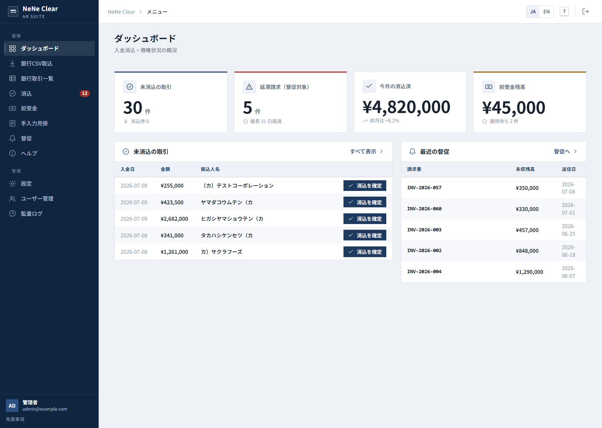
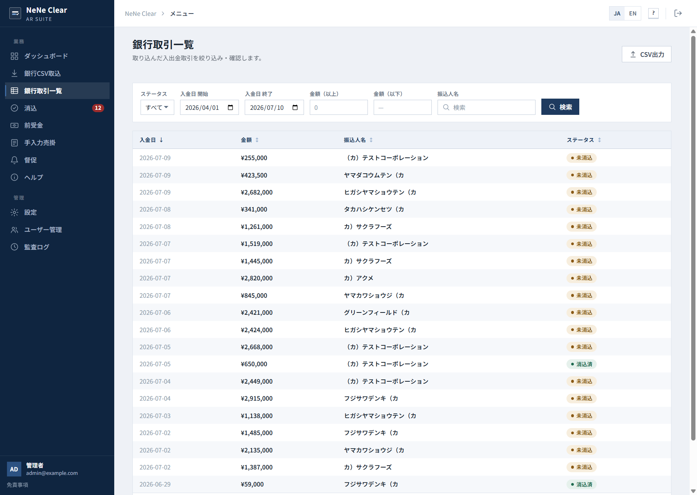
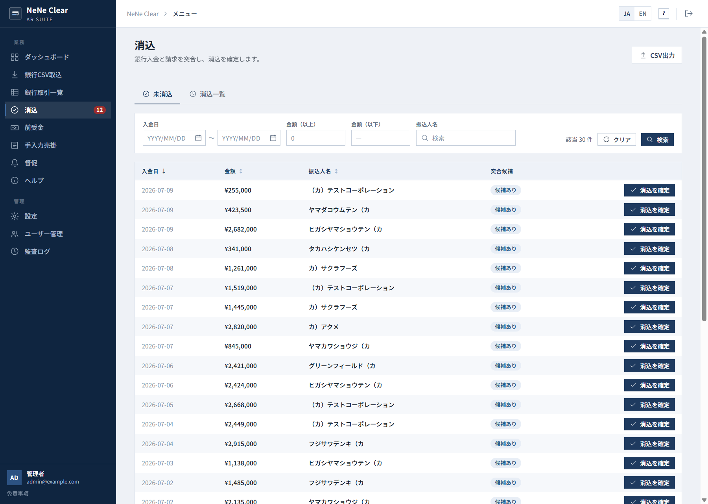
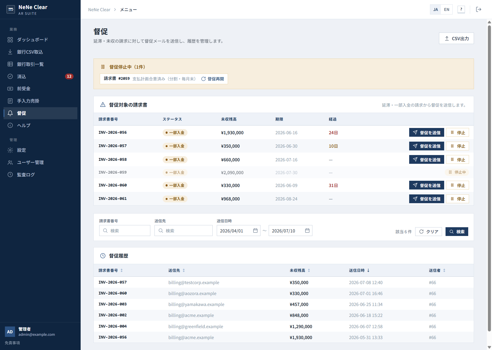
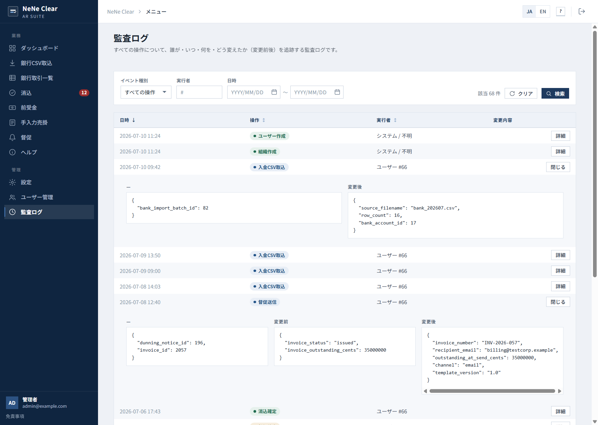

# NeNe Clear

[](./LICENSE)
[](https://www.php.net/)

**Payment reconciliation and dunning — self-hosted for Japan SMB.**

**NeNe Clear** is a **separate product** from [`nene-invoice`](https://github.com/hideyukiMORI/nene-invoice). It does **not** issue quotes or invoices. It **clears bank deposits against billed receivables** and **sends professional overdue reminders** — on [NENE2](https://github.com/hideyukiMORI/NENE2), shared hosting or Docker. Receivables come from **NeNe Invoice (optional upstream)** or are **entered / CSV-imported directly** ([manual receivables, ADR 0014](./docs/adr/0014-accept-manual-receivables.md)), so Clear runs **standalone** — no NeNe Invoice required.

> **Not upper compatible with `nene-invoice`.** Different domain, different repo, different database. See [ADR 0009](./docs/adr/0009-separate-from-nene-invoice.md).

## Domain split (binding)

| Product | Repository | What it does |
| --- | --- | --- |
| **NeNe Invoice** | `nene-invoice` | Quote, invoice, payment management — 見積・請求・入金管理 |
| **NeNe Clear** | `nene-clear` (this) | Payment reconciliation & dunning — 入金消込・督促管理 |

Operators who need both install **two sibling apps** connected via HTTP.

## Live demo

Try it now — no sign-up. The link provisions a **brand-new disposable organization** seeded with bank deposits, receivables, and dunning history, and drops you straight into its dashboard. Demo organizations are deleted automatically after about 3 hours; hit the link again for a fresh one.

- <https://clear.ayane.co.jp/demo/standard>

### Screenshots

From a disposable demo organization. Japanese UI shown — the admin UI is bilingual (ja/en, one-click switch).

**Dashboard — 30 unmatched deposits, overdue invoices, cleared-this-month total, and advance-payment balance at a glance.**



**Bank transactions — every imported deposit tracked by status, unmatched and cleared side by side.**



**Reconciliation — deposits with kana payer-name mismatches still get match-candidate badges; confirm with one click.**



**Dunning — operator-controlled reminders with days overdue, per-invoice pause (with reason), and full send history.**



**Audit log — who changed what, when, with expandable before/after JSON for every operation.**



## Goals

- **Bank reconciliation** — CSV import, human-confirmed match, audit trail
- **Dunning** — operator-controlled overdue reminders with send history
- **Compliance** — binding rules for reconciliation and dunning ([compliance doc](./docs/explanation/payment-reconciliation-dunning-compliance.md))
- **Self-hosted OSS** — MIT; recommended on **VPS + Docker** (Tier B). Shared hosting (Tier A) is **possible** via the web installer (`public_html/install.php`) but **not recommended** for receivables/bank/PII data (no root, throttled SMTP, limited DKIM & backups) — **use at your own risk**; a managed / install-service option is planned
- **AI-readable** — OpenAPI + MCP; human confirms, AI proposes
- **Optional upstream: NeNe Invoice** — when connected, invoice/payment truth via HTTP API (not a shared DB); without it, Clear reconciles and duns directly-entered / CSV-imported receivables ([ADR 0014](./docs/adr/0014-accept-manual-receivables.md))

## Non-goals

- Not quote, invoice, or qualified-invoice PDF (→ [NeNe Invoice](https://github.com/hideyukiMORI/nene-invoice))
- Not upper compatible with or a replacement for `nene-invoice`
- Not full accounting / general ledger
- Not a debt collection agency
- Not embedded inside NeNe Invoice or Records
- Not a shared database with Invoice

Full list: [`docs/explanation/product-vision.md#non-goals`](./docs/explanation/product-vision.md#non-goals)

## Documentation

| Topic | Document |
| --- | --- |
| **Domain boundary (read first)** | [`docs/adr/0009-separate-from-nene-invoice.md`](./docs/adr/0009-separate-from-nene-invoice.md) |
| **Scope contract (GOAL / DO / DON'T)** | [`docs/explanation/scope-contract.md`](./docs/explanation/scope-contract.md) |
| **Invoice upstream contract** | [`docs/integrations/invoice-upstream-contract.md`](./docs/integrations/invoice-upstream-contract.md) |
| **Philosophy** | [`docs/explanation/philosophy.md`](./docs/explanation/philosophy.md) |
| **Product vision** | [`docs/explanation/product-vision.md`](./docs/explanation/product-vision.md) |
| **Requirements** | [`docs/explanation/requirements.md`](./docs/explanation/requirements.md) |
| **Reconciliation & dunning (binding)** | [`docs/explanation/payment-reconciliation-dunning-compliance.md`](./docs/explanation/payment-reconciliation-dunning-compliance.md) |
| **Invoice upstream** | [`docs/integrations/sibling-products.md`](./docs/integrations/sibling-products.md) |
| **Agents** | [`AGENTS.md`](./AGENTS.md) |
| **Roadmap** | [`docs/roadmap.md`](./docs/roadmap.md) |

## Status

| Phase | Scope | Status |
| --- | --- | --- |
| 0 | Governance + product docs | ✅ |
| 1 | Reconciliation API — multi-tenant JWT/RBAC, bank CSV import, reconciliation (propose / confirm / reverse), client credit, audit trail | ✅ |
| 2 | Admin UI (React, ja/en) + dunning | ✅ |
| Sec | Security assessment — 2-round multi-tenant pentest, findings incl. one critical privilege escalation fixed | ✅ |
| 3 | Distribution — managed / install-service on VPS + Docker; Tier A install possible via web installer but not recommended for this data | 🔲 Next |
| 4 | Ecosystem — MCP tools, accounting-software CSV export | 🔲 |

Key shipped features:

- **Invoice upstream** HTTP client + contract tests — activate by setting `NENE_INVOICE_API_BASE_URL` / `NENE_INVOICE_BEARER_TOKEN`; a live connection against a real Invoice instance has not been exercised yet
- **Adoption Readiness milestone** (nearly complete) — UI polish, bank-account-number masking, standalone-receivables discoverability, dunning hardening, and **encryption-at-rest** for the bank account number (libsodium); the Tier A shared-hosting recommendation was retracted in favor of VPS + Docker
- **Login throttling** and optional **TOTP two-factor auth** — backend complete (enrolment + login challenge); a frontend enrolment UI and a break-glass CLI for lockout recovery are the remaining slice
- Backend (PHPUnit + PHPStan level 8), frontend (Vitest), and browser E2E (Playwright) suites all run in CI on every push/PR; a handful of Invoice-upstream contract tests auto-activate once the env vars above are set
- Security assessment: [`docs/security/assessment-2026-05.md`](./docs/security/assessment-2026-05.md)

In progress / designed: MFA frontend + break-glass CLI, real Invoice-upstream activation, CSV export tax-advisor sign-off, Phase 4 MCP tools. Details and sequencing: [`docs/roadmap.md`](./docs/roadmap.md) and [`docs/todo/current.md`](./docs/todo/current.md).

**Billing documents (見積・請求・入金):** [`nene-invoice`](https://github.com/hideyukiMORI/nene-invoice) — not this repo.

## Quickstart (local development)

```bash
# 1. Infrastructure (MySQL 8.4 on :3383, Mailpit SMTP :1383 / web UI :8383)
docker compose up -d
cp .env.example .env            # adjust DB_*, NENE2_LOCAL_JWT_SECRET as needed

# 2. Backend (PHP 8.4 with ext-curl — required by the Invoice upstream client).
composer install
composer migrations:migrate     # apply schema

# First run only: create the first organization + admin so you can log in
# (prompts for a password; or pass --password / ADMIN_PASSWORD). See --help.
php tools/create-admin.php --org-name "My Company" --email admin@example.com

php -S localhost:8384 -t public_html/    # or your preferred SAPI (NENE_CLEAR_PORT=8384)

# 3. Frontend admin UI (Node 22)
npm --prefix frontend install
npm --prefix frontend run dev   # Vite dev server on :5383, proxies /admin → backend

# Quality gates
composer check                  # PHPUnit + PHPStan level 8 + PHP-CS-Fixer
npm --prefix frontend run check # type-check + lint + Vitest
( cd tests/e2e && npm install && npx playwright test )   # browser E2E
```

`DB_ADAPTER=sqlite` (the `.env.example` default) needs no container. For a
server-grade database, set `DB_ADAPTER=mysql` (`docker compose up -d mysql`,
`DB_PORT=3383`) or `DB_ADAPTER=pgsql` (`docker compose up -d postgres`,
`DB_PORT=5483`); `DB_CHARSET` is ignored for pgsql. All three share one schema —
run `composer migrations:migrate` after switching. The PHP `pdo_pgsql` extension
is required for the pgsql adapter.

## Invoice integration (optional)

Reconciliation and dunning against **NeNe Invoice** receivables are activated by
two env vars; without them Clear runs standalone (manual receivables only,
ADR 0014). `ext-curl` is required for the HTTP client.

```bash
# In .env (or the environment):
NENE_INVOICE_API_BASE_URL=https://invoice.example.com
NENE_INVOICE_BEARER_TOKEN=<service token>
```

Obtain the service token from the Invoice side (`nene-invoice` →
`tools/issue-service-token.php`). With both set, the contract suite runs against
the live Invoice API:

```bash
NENE_INVOICE_API_BASE_URL=… NENE_INVOICE_BEARER_TOKEN=… vendor/bin/phpunit --filter InvoiceUpstreamContractTest
```

See [`docs/integrations/invoice-upstream-contract.md`](./docs/integrations/invoice-upstream-contract.md).

## Ecosystem

```
NENE2 (framework)
  ├── NeNe Records    (CMS)
  ├── NeNe Corpus     (knowledge chat)
  ├── NeNe Concierge  (scenario chat)
  ├── NeNe Invoice    (quote · invoice · payment)     ← billing documents
  └── NeNe Clear      (reconciliation · dunning)    ← this repo
```

## License

MIT — see [LICENSE](./LICENSE).
