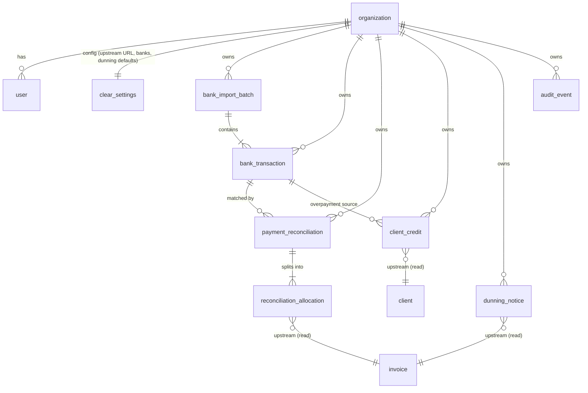

# Domain Model

NeNe Clear domain overview — entities, relationships, and state machines for
**payment reconciliation and dunning** ([ADR 0009](../adr/0009-separate-from-nene-invoice.md)).
Implementation follows Handler → UseCase → Repository layering.

> **Scope:** Clear owns bank import, matching, client credit, and dunning.
> Invoices, clients, and payments are **read from the NeNe Invoice upstream API**
> and written back via that API after a confirmed match — never stored as a
> source of truth here, never issued or tax-calculated here.

See also: [`requirements.md`](./requirements.md), [`glossary.md`](./glossary.md),
[`payment-reconciliation-dunning-compliance.md`](./payment-reconciliation-dunning-compliance.md),
[`../integrations/sibling-products.md`](../integrations/sibling-products.md).

---

## Entity relationship (MVP)

Solid entities are **owned by Clear**. The dashed `invoice` / `client` /
`payment` nodes are **upstream read models** (owned by NeNe Invoice), referenced
by id only.



- **organization**: the tenant (ADR 0006). Every tenant-scoped table carries `organization_id`. Default resolution mode `single`; agencies use path/subdomain/custom_domain.
- **user**: operator account with a `role` (superadmin/admin/member/viewer). superadmin is cross-tenant (`organization_id` NULL); all others belong to one organization.
- **clear_settings**: one row **per organization** — Invoice upstream API base URL and token, registered company bank accounts, and dunning defaults (template, minimum interval).
- **bank_import_batch**: provenance of one CSV import (`file_hash`, `source_filename`, `row_count`, `imported_by`, `imported_at`).
- **bank_transaction**: one imported deposit line; immutable after import; `unmatched` until reconciled.
- **payment_reconciliation**: a confirmed match between one bank transaction and one or more upstream invoices; its **reconciliation_allocation** rows carry the per-invoice `amount_cents`.
- **client_credit**: overpayment balance held for an upstream client and applied to future invoices by explicit operator action only.
- **dunning_notice**: immutable send record per upstream invoice.
- **invoice / client / payment**: **upstream** — read from NeNe Invoice; never an SSOT here (see [`terminology.md`](./terminology.md) §6).

---

## Bank transaction state machine

```
                    ┌─────────────┐
        import      │  unmatched  │
        ───────────►└──────┬──────┘
                           │ confirm match (full)
                           ▼
                    ┌─────────────┐
         ┌──────────│   matched   │◄─────────┐
         │ reverse  └─────────────┘          │ confirm remaining
         ▼                                   │
   ┌───────────────────┐   confirm match     │
   │ partially_matched │◄──(partial)─────────┘
   └───────────────────┘
                    (reversal import batch)
                           │
                           ▼
                    ┌─────────────┐
                    │   voided    │  (erroneous import; never hard-deleted)
                    └─────────────┘
```

**Rules:**

- Imported lines are **immutable** (amount, value date, counterparty text). Erroneous imports are corrected by a **reversal import batch**, never edited in place (compliance §3.1).
- `unmatched` → `partially_matched` while `0 < allocated < amount_cents`; → `matched` when `allocated = amount_cents`.
- A confirmed match can be **reversed**, recomputing the transaction back toward `unmatched` / `partially_matched` from remaining valid allocations.
- `voided` only via a reversal import batch; the original row is preserved.

---

## Reconciliation state machine

```
                    ┌─────────────┐
   propose + human  │  confirmed  │
   confirm ────────►└──────┬──────┘
                           │ reverse (reason_code, actor)
                           ▼
                    ┌─────────────┐
                    │  reversed   │  (reversal record; no hard delete)
                    └─────────────┘
```

**Rules:**

- Automatic suggestions (rules or AI) **MUST NOT** finalize a match without explicit operator confirmation (compliance §2.8, [`philosophy.md`](./philosophy.md) §1.4).
- Confirming a match calls the Invoice API to create/update the upstream payment, then stores the `payment_reconciliation` + `reconciliation_allocation` rows and an `audit_event`.
- Reversal creates a reversal record, calls the Invoice API to restore outstanding, and recomputes affected bank transaction status. No payment or bank history is hard-deleted.

---

## Upstream invoice status (read-only, owned by NeNe Invoice)

Clear does **not** own these transitions; it mirrors them read-only to drive
matching UI and dunning eligibility.

```
issued ──► partially_paid ──► paid
   │            │
   └────────────┴──► overdue (computed when due_at < now and outstanding > 0)
```

Dunning is eligible only for `issued`, `partially_paid`, or `overdue` with
outstanding > 0 (compliance §4.1).

---

## Allocation logic (UseCase)

Single source of truth for matching a bank transaction to upstream invoices.
Clear never calculates invoice tax or totals — it only **allocates a known
deposit amount** against outstanding balances reported by Invoice.

```
Given one bank_transaction with amount_cents,
and operator-chosen allocations [(invoice_id, amount_cents), ...]:

sum(allocation.amount_cents) MUST equal bank_transaction.amount_cents
    (or leave a documented remainder per the overpayment / fee rules)

For each allocation:
  outstanding = upstream invoice.outstanding_cents   # fetched from Invoice API
  if allocation.amount_cents <= outstanding:
      write payment to Invoice API (paid_at = bank_transaction.value_date)
  elif allocation.amount_cents > outstanding:
      allocate outstanding to the invoice;
      record excess as client_credit (NEVER discard)        # compliance §2.5

Transfer-fee mismatch (credit < invoice total): operator chooses
  (1) partial payment [default], (2) fee absorption (admin + reason_code),
  or (3) separate expense — each leaves an audit_event.     # compliance §2.4
```

`paid_at` uses the **bank value date** (`value_date`), not the confirm date
(compliance §2.2). Each confirmed allocation produces an `audit_event`. See
[`payment-reconciliation-dunning-compliance.md`](./payment-reconciliation-dunning-compliance.md)
for the binding rules.

---

## Dunning eligibility and send (UseCase)

```
Eligible(invoice) :=
    invoice.status in {issued, partially_paid, overdue}
    AND invoice.outstanding_cents > 0
    AND NOT invoice voided
    AND client has a deliverable recipient_email
    AND (now - last dunning_notice.sent_at for this invoice) >= minimum interval

On send:
  render template (invoice number, dates, outstanding_at_send_cents,
                   bank instructions from clear_settings)
  send via operator SMTP
  write immutable dunning_notice (template_version, recipient_email, sent_by, sent_at)
  write audit_event
```

Default minimum interval is **7 days** (compliance §4.2). Default templates MUST
NOT threaten legal action or auto-compute statutory interest (compliance §4.4).

---

## Import batch identity

Clear issues **no** statutory document numbers (those belong to NeNe Invoice).
Import provenance is identified by:

| Field | Purpose |
| --- | --- |
| `bank_import_batch_id` | Internal batch id |
| `file_hash` (SHA-256) | Duplicate-import detection (`duplicate-bank-import`) |
| `source_filename` | Operator traceability |
| `imported_at` / `imported_by` | Audit |

Duplicate file hash or duplicate line key MUST warn or block re-import
(compliance §3.1).

---

## Upstream integration boundary

```
UseCase (matching, dunning eligibility)
    ↓ depends on interface, not concrete HTTP client
Upstream/Invoice/InvoiceUpstreamClientInterface
    ↓ implemented by
Upstream/Invoice/HttpInvoiceUpstreamClient (reads invoices/clients; writes payments)
```

UseCases depend on the upstream **interface**, never on a concrete HTTP client.
If the Invoice API is unavailable, Clear enters **degraded mode**: import still
works; match confirmation (which writes upstream) is blocked with an operator
warning (`upstream-invoice-unavailable`). See
[`../integrations/sibling-products.md`](../integrations/sibling-products.md).

---

## Planned modules (`src/`)

| Module | Responsibility |
| --- | --- |
| `Organization/` | Tenants + per-request resolution (`Organization/Resolution/`) — superadmin CRUD |
| `Auth/` | JWT login, `Role` / `Capability`, capability middleware |
| `User/` | Operator accounts within an organization — admin CRUD |
| `Settings/` | `ClearSettings` — upstream URL/token, bank accounts, dunning defaults (per organization) |
| `BankImport/` | CSV import, `bank_import_batch`, `bank_transaction`, duplicate detection |
| `Reconciliation/` | Match proposal, confirmation, allocation, reversal |
| `ClientCredit/` | Overpayment balances and application |
| `Dunning/` | Templates, send, send history |
| `Upstream/Invoice/` | Invoice API client (read invoices/clients, write payments) |
| `Audit/` | Immutable audit events |
| `Http/` | Shared HTTP plumbing |

---

## Related

- Requirements: [`requirements.md`](./requirements.md)
- Reconciliation & dunning compliance (binding): [`payment-reconciliation-dunning-compliance.md`](./payment-reconciliation-dunning-compliance.md)
- Backend standards: [`../development/backend-standards.md`](../development/backend-standards.md)
- ADR 0006 (tenancy & roles): [`../adr/0006-multi-tenancy-and-roles.md`](../adr/0006-multi-tenancy-and-roles.md)
- ADR 0009 (domain split): [`../adr/0009-separate-from-nene-invoice.md`](../adr/0009-separate-from-nene-invoice.md)
